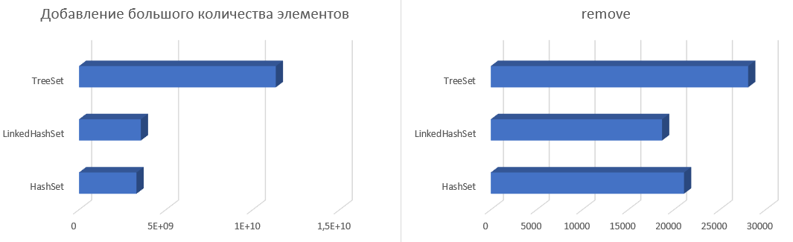
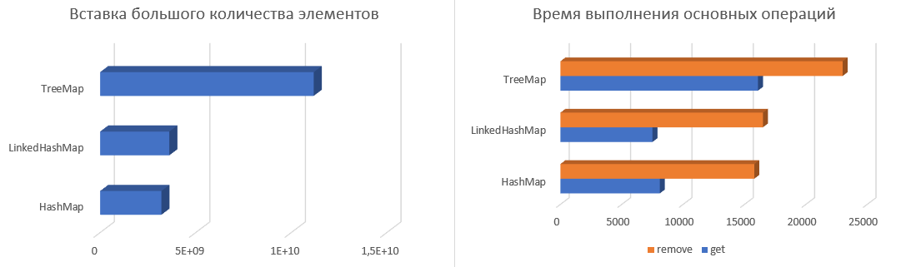

# Homework3

## Задача: 
> 1. Разработать пользовательскую структуру данных MyLinkedList
> 2. Написать тестовый класс, измеряющий с помощью System.nanoTime()
> время выполнения основных операций для LinkedList, MyLinkedList, ArrayList, HashSet, LinkedHashSet, TreeSet, HashMap, LinkedHashMap, TreeMap.

## Комментарии:
>С разработкой пользовательской структуры я справился успешно. Была
> проведена проверка основного функционала в классе
> "TestMainFunctionality". Переходя ко второй части домашнего задания, а
> именно к тестированию производительности я столкнулся с проблемой,
> замеряя время с помощью System.nanoTime() или любым другим подобным инструментом,
> значения получались некорректные для следующих после первой структур
> данных, это происходило потому что я не изолировал работу с коллекциями друг от друга, поэтому при 
> переходе к следующим после первой коллекциям не могло гарантироваться как минимум отработка сборщика
> мусора который при таких объемах данных съедает ощутимую часть времени. Вроде как я нашёл, как правильно
> тестировать производительность кода с помощью JMH, но для работы с ним потребуется как минимум сборщик
> проекта, поэтому эту идею я откинул. Подумал про отделение этих операций с помощью создания разных потоков, но
> потом вспомнил, что тестируемые структуры данных не потокобезопасны и я подумал, что особой разницы, как костылять
> нет, поэтому решил отделить работу с каждой коллекцией с помощью switch. В плане юзабилити получилось не очень, так
> как для проверки результатов надо всегда перезапускать программу и выбирать нужный пункт, зато результат, выдаваемый
> моими тестами достоверен. Это было объяснение, почему класс "TestPerformance" такой некрасивый, странный и тд.
> * Поправка с 23.11.21 -> класс TestPerformance доработан, и теперь выглядит более менее по-человечески
## Выводы:
> Добавление:
> * LinkedList      671863500
> * MyLinkedList    625050300
> * ArrayList       224962699
> * HashSet         3309247501
> * LinkedHashSet   3560761200
> * TreeSet         11328284800
> * HashMap         3206497400
> * LinkedHashMap   3621397600
> * TreeMap         11175900500

> Поиск:
> * LinkedList      13223300
> * MyLinkedList    13316700
> * ArrayList       5500
> * HashMap         8100
> * LinkedHashMap   7500
> * TreeMap         16100

> Удаление:
> * LinkedList      21200   13001600 21400 
> * MyLinkedList    14500   13668100 14700
> * ArrayList       3876800 1929500  14600
> * HashSet         21100   
> * LinkedHashSet   18700
> * TreeSet         28100
> * HashMap         15800
> * LinkedHashMap   16500
> * TreeMap         23000

> Вставка:
> * LinkedList      13113800
> * MyLinkedList    13023200
> * ArrayList       2131300

> Изменение:
> * LinkedList      13764500
> * MyLinkedList    15554700
> * ArrayList       6500

## Выводы:
> 1. LinkedList & MyLinkedList vs ArrayList. Тестирование показало, что ArrayList лидирует во всех дисциплинах, 
> за исключением операций вставки и удаления элемента в/из начало списка. Несмотря на то, что с точки зрения теории
> операции вставки и удаления в ArrayList должны работать медленно по сравнению с LinkedList, так для вставки или удаления
> элемента ArrayList копирует и сдвигает каждый элемент, а в LinkedList "всего лишь" происходит изменение ссылки будущих/бывших соседей,
> но этих соседей ещё предстоит найти, а поиск элемента это одно из слабых мест LinkedList, поэтому на практике получается, что вставка и удаление
> элемента в ArrayList, если говорить про центр списка, работает быстрее чем в LinkedList, но
> если проводить эти операции с началом списка, то ArrayList начинает работать чудовищно медленно по сравнению с LinkedList. Если говорить про операции
> взятия элемента и изменения элемента (get, set), то тут, как и должно быть ArrayList работает на порядки быстрее. Что использовать? Если планируется частая
> работа с началом списка (вставка/удаление) LinkedList, во всех остальных случаях ArrayList.

> 2. HashSet, LinkedHashSet, TreeSet. С точки зрения теории, HashSet должен быть самый быстрый, LinkedHashSet должен быть чуть медленнее HashSet или такой же, a
> TreeSet самый медленный среди этой троицы из-за операций сортировки. Практика подтвердила теорию. В каких случаях удобно использовать ту или иную коллекцию из этой
> троицы? Если нам просто надо хранить добавленные элементы без сохранения какой-либо последовательности, то стоит воспользоваться HashSet, если необходимо поддерживать
> порядок вставки, то LinkedHashSet, и TreeSet в котором поддерживается порядок элементов по сортировки.

> 3. HashMap, LinkedHashMap, TreeMap. С точки зрения теории производительность HashMap и LinkedHashMap одинакова (O(1)), а TreeMap O(log(n)).
> Практика подтвердила теорию. Что использовать? Опять же всё зависит от задачи, если
> необходимо просто хранить пару ключ-значение без поддержки какого-либо порядка - HashMap, если
> нужна поддержка порядка вставки элемента - LinkedHashMap, если нужна сортировка по
> ключу - TreeMap.

